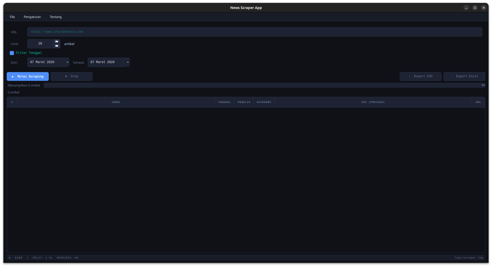
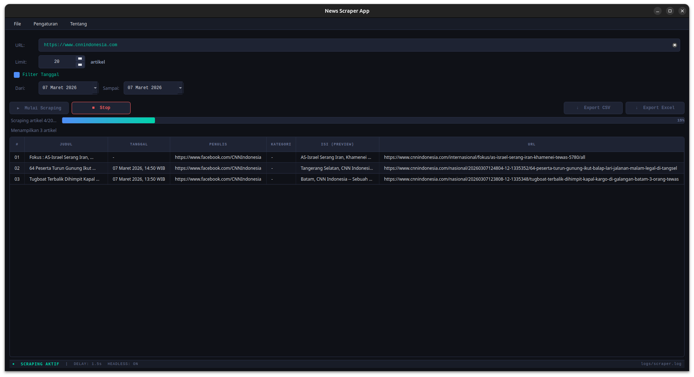
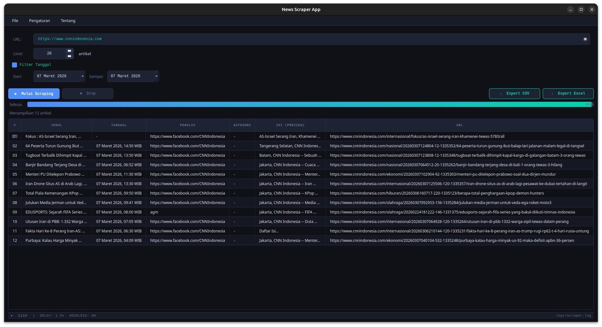
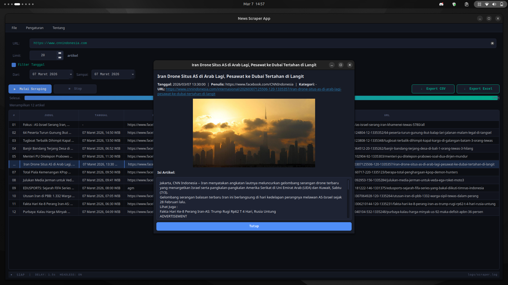
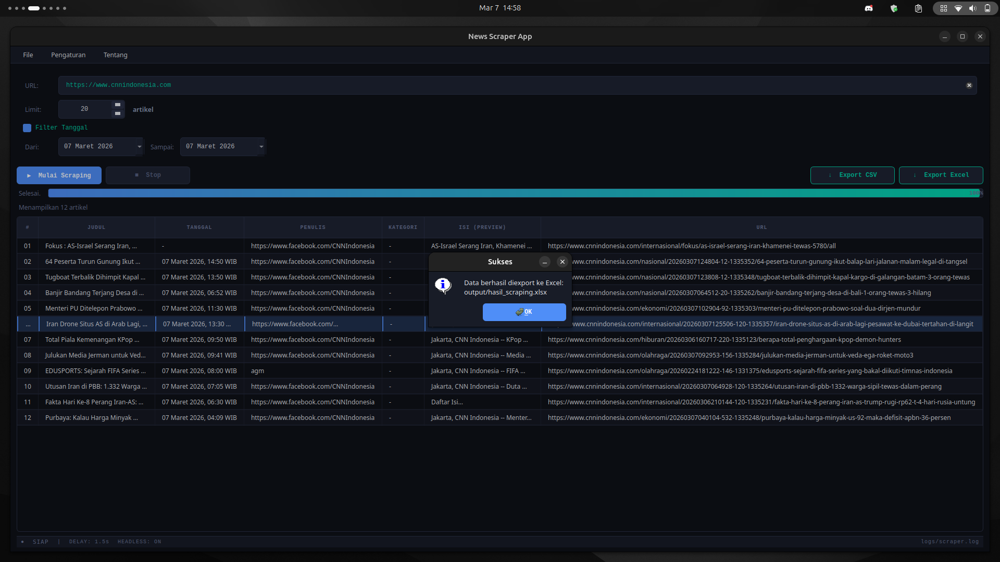

# 📰 News Scraper App

Aplikasi desktop Python untuk **scraping artikel berita otomatis** dari website berita Indonesia. Cukup masukkan URL halaman berita, aplikasi akan mengumpulkan semua artikel beserta isinya secara otomatis dan menampilkannya dalam tabel yang rapi.

**Stack:** Python 3.12 · Selenium · PyQt5 ≥ 5.15 · pandas · openpyxl · Chrome 145 headless

---

## ✨ Fitur Lengkap

### Scraping
| Fitur | Keterangan |
|-------|-----------|
| **Scraping otomatis** | Masukkan URL halaman kategori/berita, aplikasi mengambil seluruh artikel |
| **3-layer extraction** | OpenGraph/Schema.org → wildcard CSS → class spesifik per situs |
| **Pagination otomatis** | Mengikuti halaman berikutnya (4 strategi: `rel=next`, teks, URL pattern) |
| **Validasi artikel** | Hanya artikel dengan judul ≥15 karakter dan isi ≥100 karakter yang ditampilkan |
| **Limit artikel** | Atur jumlah maksimal artikel yang diambil (1–500, default 20) |
| **GUI tidak freeze** | Scraping berjalan di thread terpisah (`QThread`) agar antarmuka tetap responsif |

### Filter & Tampilan
| Fitur | Keterangan |
|-------|-----------|
| **Filter tanggal** | Saring artikel berdasarkan rentang tanggal (parse multi-format ID/EN) |
| **Tabel 7 kolom** | `#`, `Judul`, `Tanggal`, `Penulis`, `Kategori`, `Isi (preview)`, `URL` |
| **Dialog detail** | Double-click baris → popup dengan gambar asli + isi lengkap (max 2000 karakter) |
| **Progress bar** | Indikator kemajuan real-time dengan label status scraping |
| **Bottom status bar** | Indikator state (SIAP/AKTIF), delay, mode headless, dan path file log |

### Export & Log
| Fitur | Keterangan |
|-------|-----------|
| **Export CSV** | Simpan hasil ke `.csv` (encoding UTF-8 BOM agar kompatibel Excel) |
| **Export Excel** | Simpan hasil ke `.xlsx` dengan lebar kolom otomatis |
| **Logging** | Semua aktivitas dicatat ke `logs/scraper.log` dan console |

---

## ⚙️ Mode Headless

Mode headless menjalankan browser Chrome **tanpa tampilan jendela** di latar belakang.

| | Headless ON | Headless OFF |
|---|---|---|
| **Kecepatan** | Lebih cepat (tidak render UI browser) | Lebih lambat |
| **Tampilan** | Tidak ada jendela Chrome yang muncul | Jendela Chrome terlihat |
| **Default** | ✅ Aktif | — |
| **Cara ubah** | Menu **Pengaturan → Konfigurasi Scraping** → centang/uncentang *Mode Headless* → Simpan | |

> Status headless saat ini terlihat di **bottom bar** aplikasi: `HEADLESS: ON` atau `HEADLESS: OFF`.  
> Perubahan pengaturan headless hanya berlaku untuk sesi scraping **berikutnya**.

---

## ⌨️ Shortcut Keyboard

| Shortcut | Aksi |
|----------|------|
| `Ctrl + R` | Mulai Scraping |
| `Ctrl + Q` | Stop Scraping |
| `Ctrl + Shift + C` | Export CSV |
| `Ctrl + Shift + E` | Export Excel |
| `Ctrl + W` | Keluar dari aplikasi |
| `Double-click` baris tabel | Buka dialog detail artikel |

Semua shortcut juga tersedia via **menu bar** di bagian atas (File / Pengaturan / Tentang).

---

## 🗂️ Menu Bar

### Menu File
- **▶ Mulai Scraping** `Ctrl+R` — memulai proses scraping
- **■ Stop Scraping** `Ctrl+Q` — menghentikan scraping yang sedang berjalan
- **↓ Export CSV** `Ctrl+Shift+C` — menyimpan data ke file `.csv`
- **↓ Export Excel** `Ctrl+Shift+E` — menyimpan data ke file `.xlsx`
- **Keluar** `Ctrl+W` — menutup aplikasi

### Menu Pengaturan
- **⚙ Konfigurasi Scraping** — dialog untuk mengubah:
  - **Delay antar request** (0.5–10 detik, default 1.5 detik) — jeda antar halaman agar tidak diblokir server
  - **Mode Headless** (ON/OFF) — jalankan browser tanpa tampilan
  - **Timeout halaman** (5–60 detik, default 30 detik) — batas waktu tunggu halaman load
  - **Maks isi artikel** (500–10.000 karakter, default 2000 karakter) — batas panjang isi yang disimpan

### Menu Tentang
- **ℹ Tentang Aplikasi** — informasi versi dan deskripsi aplikasi
- **👥 Tim Pengembang** — daftar anggota tim dan peran masing-masing

---

## 📊 Bottom Status Bar

Status bar di bawah layar menampilkan informasi real-time:

```
● SIAP  |  DELAY: 1.5s  HEADLESS: ON  logs\scraper.log
```

| Elemen | Keterangan |
|--------|-----------|
| `●` hijau / `●` merah | Indikator state: **hijau** = SIAP, **merah** = SCRAPING AKTIF |
| `SIAP` / `SCRAPING AKTIF` | Status proses saat ini |
| `DELAY: 1.5s` | Jeda antar request yang sedang digunakan |
| `HEADLESS: ON/OFF` | Mode headless saat ini |
| `logs\scraper.log` | Path file log yang sedang aktif |

---

## 📋 Prasyarat

- **Python** 3.12 atau lebih baru
- **Google Chrome** 112+ terinstall (direkomendasikan 145+)
- **pip** (Python package manager)

---

## 🚀 Instalasi

1. **Clone repository**
   ```bash
   git clone https://github.com/<username>/news-scraper.git
   cd news-scraper
   ```

2. **Install dependencies**
   ```bash
   pip install -r requirements.txt
   ```
   > Pada Linux/Mac gunakan `pip3` jika `pip` mengarah ke Python 2.

---

## ▶️ Cara Menjalankan

```bash
python3 main.py
```

---

## 📖 Panduan Penggunaan

### Scraping Dasar

1. Jalankan aplikasi dengan `python3 main.py`
2. Masukkan **URL** halaman kategori berita di kolom URL
   - Contoh: `https://www.cnnindonesia.com/nasional`
   - URL harus diawali `http://` atau `https://`
3. Atur **Limit** jumlah artikel yang ingin diambil (1–500)
4. Klik **▶ Mulai Scraping** atau tekan `Ctrl+R`
5. Tunggu hingga progress bar mencapai 100%
6. Hasil tampil di tabel — kolom Isi menampilkan preview 150 karakter pertama

### Menggunakan Filter Tanggal

1. Centang **Filter Tanggal** untuk mengaktifkan filter
2. Pilih **Dari** (tanggal mulai) menggunakan popup kalender
3. Pilih **Sampai** (tanggal akhir) menggunakan popup kalender
4. Jalankan scraping — hanya artikel dalam rentang tanggal tersebut yang ditampilkan

> **Catatan:** Artikel tanpa informasi tanggal tetap ditampilkan secara default.

### Melihat Detail Artikel

- **Double-click** baris mana pun di tabel untuk membuka dialog detail
- Dialog menampilkan:
  - Gambar thumbnail artikel (jika ada)
  - Judul, tanggal, penulis, kategori, dan URL lengkap
  - Isi artikel hingga 2000 karakter

### Mengubah Konfigurasi Scraping

1. Buka **Pengaturan → Konfigurasi Scraping** dari menu bar
2. Ubah nilai yang diinginkan:
   - **Delay** — naikkan jika sering diblokir server (min 1.0 detik disarankan)
   - **Mode Headless** — matikan (OFF) jika ingin melihat proses di browser
   - **Timeout** — naikkan jika scraping sering gagal di situs lambat
3. Klik **Simpan** — perubahan langsung berlaku untuk scraping berikutnya

### Export Hasil

1. Pastikan tabel sudah berisi data hasil scraping
2. Klik **↓ Export CSV** (`Ctrl+Shift+C`) untuk menyimpan ke `.csv`
   - File disimpan di folder `output/` dengan nama berisi timestamp
   - Encoding UTF-8 BOM — aman dibuka di Microsoft Excel
3. Klik **↓ Export Excel** (`Ctrl+Shift+E`) untuk menyimpan ke `.xlsx`
   - Lebar kolom disesuaikan otomatis

---

## 🕷️ Strategi Scraping (3-Layer Extraction)

```
Lapisan 1 — UNIVERSAL (OpenGraph + Schema.org)
  → og:title, article:published_time, articleBody, og:image
  → Standar internasional, bekerja di hampir semua situs berita modern

Lapisan 2 — SEMI-UMUM (wildcard CSS + HTML5 semantik)
  → [class*='article-body'], [class*='author'], <article>, <time>, <h1>
  → Fallback jika meta tags tidak tersedia

Lapisan 3 — OPTIMASI (class spesifik per situs)
  → .detail__title (Detik), .read__title (Kompas), .title (CNN Indonesia)
  → Akurasi lebih tinggi untuk situs yang sudah dikenal
```

---

## 📁 Struktur Proyek

```
news-scraper/
├── main.py          ← Entry point: buat folder, setup logger, apply style
├── config.py        ← Pengaturan global (konstanta, path, threshold)
├── scraper.py       ← 3-layer scraping: OG/Schema → wildcard → site-specific
├── worker.py        ← QThread: 5 sinyal jembatan GUI ↔ scraper
├── filter.py        ← Filter tanggal multi-format Indonesia & Inggris
├── gui.py           ← InputPanel + MainWindow (tabel, dialog detail, bottom bar)
├── style.py         ← Dark theme QSS (#0F1117 bg)
├── exporter.py      ← Export CSV (utf-8-sig) & Excel (auto-width)
├── logger.py        ← Logging file + console
├── requirements.txt ← Dependensi runtime
├── output/          ← Folder hasil export (dibuat otomatis)
├── logs/            ← Folder file log (dibuat otomatis)
└── docs/            ← Dokumentasi & screenshot
    └── screenshots/
```

---

## 🖼️ Preview Tampilan

### 1. Tampilan Awal — Siap Input

> Kondisi aplikasi pertama dibuka. Bottom bar menampilkan `● SIAP` dan konfigurasi aktif.

### 2. Input Panel — Filter Tanggal Aktif

> Checkbox Filter Tanggal dicentang, field kalender Dari dan Sampai menjadi aktif.

### 3. Proses Scraping Berjalan

> Tombol Stop aktif (merah), progress bar bergerak, bottom bar menampilkan `● SCRAPING AKTIF` dan status artikel saat ini.

### 4. Hasil Scraping Selesai

> Tabel terisi data artikel dengan 7 kolom. Label status menampilkan jumlah artikel valid yang ditemukan.

### 5. Dialog Detail Artikel (Double-click)

> Popup menampilkan gambar thumbnail, metadata lengkap (judul, tanggal, penulis, kategori, URL), dan isi artikel hingga 2000 karakter.

### 6. Dialog Konfigurasi Scraping

> Dialog pengaturan: delay, mode headless (ON/OFF), timeout halaman, dan batas panjang isi artikel.

### 7. Hasil Export Excel

> File `.xlsx` dengan 8 kolom (termasuk Gambar_URL) dan lebar kolom otomatis.

## 👥 Tim Pengembang

| Nama | Peran | File |
|------|-------|------|
| **Darva** | Lead Developer + Reviewer | `scraper.py`, `worker.py`, `filter.py`, `main.py` |
| **Kemal** | Data & Reliability Dev | `config.py`, `logger.py`, `exporter.py` |
| **Richard** | GUI Developer (Fungsional) | `gui.py` (MainWindow) |
| **Kyla** | GUI Developer (Input & Filter) | `gui.py` (InputPanel) |
| **Aulia** | UI Polish + Dokumentasi | `style.py`, `README.md`, laporan |

---

## 📄 Lisensi

Proyek ini dibuat untuk keperluan tugas kelompok mata kuliah Proyek Pengembangan Perangkat Lunak Desktop.
