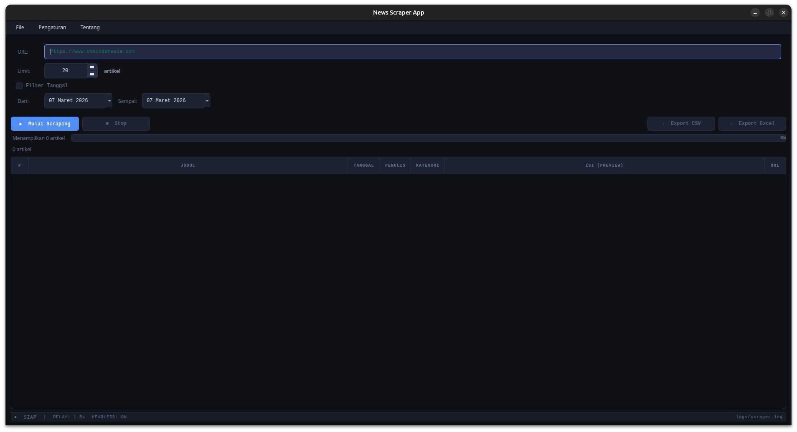

# 📰 News Scraper App

Aplikasi desktop Python untuk **scraping artikel berita otomatis** dari website berita Indonesia. Cukup masukkan URL halaman berita, dan aplikasi akan mengumpulkan semua artikel beserta isinya secara otomatis.

**Stack:** Python 3.12 · Selenium · PyQt5 ≥ 5.15 · pandas · openpyxl · Chrome 145 headless

---

## ✨ Fitur

### Wajib
- **Scraping otomatis** — masukkan URL, aplikasi mengambil semua artikel via 3-layer extraction
- **Pagination** — otomatis mengikuti halaman berikutnya (4 strategi: rel=next, teks, URL pattern)
- **Validasi data** — hanya artikel valid (judul ≥15ch & isi ≥100ch) yang ditampilkan
- **Tabel 7 kolom** — #, Judul, Tanggal, Penulis, Kategori, Isi (preview 150ch), URL
- **GUI responsif** — antarmuka tidak freeze saat scraping (QThread)

### Opsional
- **Filter tanggal** — saring artikel berdasarkan rentang tanggal (parse multi-format ID/EN)
- **Limit artikel** — atur jumlah maksimal artikel (1–500, default 20)
- **Export CSV & Excel** — simpan hasil ke `.csv` (utf-8-sig) atau `.xlsx` (auto-width)
- **Progress bar** — gradient biru→teal + label status real-time
- **Logging** — pencatatan aktivitas ke file log + console

### Bonus
- **3-layer extraction** — OpenGraph/Schema.org → wildcard CSS → site-specific
- **Dialog detail** — double-click baris → popup gambar asli (QPixmap) + isi 2000ch + meta
- **Bottom status bar** — dot indicator (SIAP/AKTIF) + delay + headless + logfile
- **Dark theme** — QSS styling (#0F1117 bg, #4F8EF7 accent, #00D4AA teal)

---

## 📋 Prasyarat

- **Python** 3.12 atau lebih baru
- **Google Chrome** 145+ terinstall
- **pip** (Python package manager)

---

## 🚀 Instalasi

1. **Clone repository**
   ```bash
   git clone https://github.com/<username>/news-scraper.git
   cd news-scraper
   ```

2. **Install dependencies**
   ```bash
   pip install -r requirements.txt
   ```
   > Pada Linux/Mac gunakan `pip3` jika `pip` mengarah ke Python 2.

---

## ▶️ Cara Menjalankan

```bash
python3 main.py
```

### Alur Penggunaan

1. Masukkan **URL** halaman berita (contoh: halaman kategori CNN/Detik/Kompas)
2. *(Opsional)* Atur **limit** jumlah artikel (1–500)
3. *(Opsional)* Centang **Filter Tanggal** dan pilih rentang tanggal
4. Klik **▶ Mulai Scraping** — tunggu progress bar selesai
5. Hasil muncul di tabel: #, Judul, Tanggal, Penulis, Kategori, Isi (preview), URL
6. **Double-click** baris untuk lihat detail lengkap (gambar + isi 2000ch)
7. Klik **↓ Export CSV** atau **↓ Export Excel** untuk menyimpan data

---

## 📁 Struktur Proyek

```
news-scraper/
├── main.py                   ← Entry point: buat folder, setup logger, apply style
├── config.py                 ← Pengaturan global (konstanta, path, threshold)
├── scraper.py                ← 3-layer scraping: OG/Schema → wildcard → site-specific
├── worker.py                 ← QThread: 5 sinyal jembatan GUI ↔ scraper
├── filter.py                 ← Filter tanggal multi-format Indonesia & Inggris
├── gui.py                    ← InputPanel + MainWindow (tabel, dialog detail, bottom bar)
├── style.py                  ← Dark theme QSS (#0F1117 bg)
├── exporter.py               ← Export CSV (utf-8-sig) & Excel (auto-width)
├── logger.py                 ← Logging file + console
├── requirements.txt          ← Dependensi runtime
├── requirements-dev.txt      ← Dev tools (pyqt5-tools)
├── test_scraper_cli.py       ← Test scraper CLI tanpa GUI
├── test_results.txt          ← Hasil test terakhir
├── gui-mockup (1).html       ← Mockup desain GUI (dark theme reference)
├── output/                   ← Folder hasil export
├── logs/                     ← Folder log aplikasi
└── docs/                     ← Dokumentasi & screenshot
    ├── AI_CONTEXT.md
    ├── BLUEPRINT_NEWS_SCRAPER.md
    ├── COMMIT_GUIDE.md
    ├── PROMPT_GUIDE.md
    ├── TESTING_CHECKLIST.md
    ├── laporan.md
    └── screenshots/
```

---

## 🕷️ Strategi Scraping (3-Layer Extraction)

```
Lapisan 1 (UNIVERSAL)    — OpenGraph + Schema.org meta tags
  → og:title, article:published_time, articleBody, og:image
  → Standar internasional, works on ANY modern news website

Lapisan 2 (SEMI-UMUM)    — wildcard [class*='...'] + semantic HTML5
  → [class*='article-body'], [class*='author'], <article>, <time>, <h1>

Lapisan 3 (OPTIMASI)     — class spesifik per website yang dikenal
  → .detail__title (Detik), .read__title (Kompas), .title (CNN)
  → Shortcut untuk akurasi lebih tinggi
```

---

## 📸 Screenshot

> Screenshot tersedia di folder `docs/screenshots/`

| Tampilan Awal | Saat Scraping | Hasil Selesai |
|:---:|:---:|:---:|
|  |  |  |

---

## 👥 Tim Pengembang

| Nama | Peran | File |
|------|-------|------|
| **Darva** | Lead Developer + Reviewer | `scraper.py`, `worker.py`, `filter.py`, `main.py` |
| **Kemal** | Data & Reliability Dev | `config.py`, `logger.py`, `exporter.py` |
| **Richard** | GUI Developer (Fungsional) | `gui.py` (MainWindow) |
| **Kyla** | GUI Developer (Input & Filter) | `gui.py` (InputPanel) |
| **Aulia** | UI Polish + Dokumentasi | `style.py`, `README.md`, laporan |

---

## 📄 Lisensi

Proyek ini dibuat untuk keperluan tugas kelompok mata kuliah Proyek Pengembangan Perangkat Lunak Desktop.
